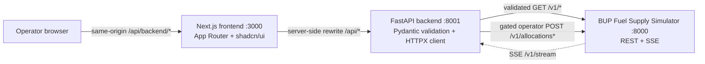
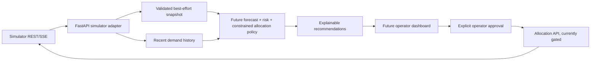

# Architecture overview

## Current repository architecture



Current implementations:

- **Frontend (`frontend/`)**: Next.js 16 App Router, React 19, TypeScript, Tailwind CSS v4, shadcn/ui, TanStack Query, and a responsive operator overview that renders live station inventory, depot stock, demand history, supply arrivals, events, and allocation status. Recommendations and operator action controls are not yet implemented.
- **Frontend-to-backend proxy**: Next rewrites `/api/backend/:path*` to the server-only `BACKEND_API_URL` plus `/api/:path*`. Example: browser `GET /api/backend/v1/dashboard/snapshot` → FastAPI `GET /api/v1/dashboard/snapshot`. The browser never calls the simulator or a `localhost` URL directly.
- **Backend (`backend/`)**: FastAPI with a reusable async HTTPX client configured by `SIMULATOR_BASE_URL` and `SIMULATOR_TIMEOUT_SECONDS`. It validates known simulator data with Pydantic models, maps upstream errors, and proxies documented SSE events. `/api/v1/dashboard/snapshot` fetches data concurrently and reports per-resource availability/freshness; `/api/v1/allocations` and its cancellation route forward explicit commands only when `SIMULATOR_WRITES_ENABLED=true`.
- **Simulator**: supplied organizer image; expected local port is 8000. It is not part of this repository and must not be modified to solve the challenge.
- **Container/deployment layer**: root `docker-compose.yml` runs all three services and can target only `backend` (bringing up the simulator dependency) for a VPS + Vercel split. The two app Dockerfiles are under `backend/` and `frontend/`; `deploy/README.md` documents both modes. The Dockerfiles/Compose were authored and statically checked, but not built with Docker because no Docker daemon was available in the authoring environment.

## Frontend/backend data and action flow

```mermaid
sequenceDiagram
  participant UI as Operator UI
  participant FE as Next.js server
  participant API as FastAPI
  participant SIM as Simulator
  UI->>FE: GET /api/backend/v1/dashboard/snapshot
  FE->>API: rewrite to /api/v1/dashboard/snapshot
  API->>SIM: parallel validated GET /v1/* requests
  SIM-->>API: state resources + freshness headers
  API->>API: validate, annotate partial/stale state, compare instance tick before/after
  API-->>FE: aggregate snapshot + resource_status
  FE-->>UI: same-origin response
  UI->>FE: POST /api/backend/v1/allocations (after operator approval)
  FE->>API: rewrite to /api/v1/allocations
  API->>API: validate command; enforce writes feature flag
  API->>SIM: POST /v1/allocations
  SIM-->>API: allocation result
  API->>API: validate response
  API-->>UI: validated action result / structured error
  UI->>FE: refetch snapshot and allocations

  SIM-->>API: SSE notification
  API-->>FE: validated SSE response chunk
  FE-->>UI: same-origin stream notification
  UI->>FE: refetch state over REST
```

The snapshot is a best-effort parallel read, not a simulator-side transaction. `consistent` is true only when the instance tick sampled before and after aggregation is equal; resource status independently communicates failures and stale responses. REST remains the source of truth. SSE notifications should prompt the frontend to refetch affected state; after SSE reconnect, perform a full state refresh because the simulator does not replay missed events. WebSocket support is not part of this milestone.

## Future decision intelligence



The recommendation engine should remain a pure/testable layer that receives validated state and recent demand history. Keep analysis output distinct from an approved allocation request. There is currently **no recommendation engine or frontend action UI**. Allocation create/cancel routes forward explicit commands only; they do not recommend or automatically submit shipments. The backend has no operator authentication/authorization, so writes stay disabled by default and must not be enabled on a public host without a protection layer.

## Runtime configuration and ports

| Service   | Default port | Relevant configuration |
| --------- | -----------: | --- |
| Simulator | 8000 | Organizer image; simulator-specific environment is documented in its guide |
| FastAPI | 8001 | `SIMULATOR_BASE_URL` defaults to `http://localhost:8000`; `SIMULATOR_TIMEOUT_SECONDS` defaults to 8; `SIMULATOR_WRITES_ENABLED` defaults to false |
| Next.js | 3000 | `BACKEND_API_URL` defaults to `http://127.0.0.1:8001`; value is server-only |

When running in containers, set `BACKEND_API_URL` to the backend service name, e.g. `http://backend:8001`, and `SIMULATOR_BASE_URL` to the simulator service name, e.g. `http://simulator:8000`. Do not ship a browser-visible environment variable containing a sandbox-only `localhost` address.

For the all-in-one stack, `docker compose up --build -d` builds both apps and starts the simulator. For split deployment, run `docker compose up -d --build backend` on the VPS (Compose also starts the simulator); set Vercel's build-time `BACKEND_API_URL` to the VPS HTTPS API origin. The Next rewrite is emitted at build time, so redeploy after changing it. Keep simulator/admin and backend host ports private; expose FastAPI through a TLS reverse proxy. Before enabling allocation writes, add operator authentication/access control. Validate the SSE stream through the chosen Vercel/runtime platform because serverless response-duration limits may affect long-lived connections.

## Reliability boundaries

- The simulator can be unavailable, slow, stale, or streaming-disconnected.
- FastAPI provides schema validation and normalized gateway errors; backend liveness does not require simulator availability.
- The UI should label stale/degraded data and disable unsafe actions until refreshed.
- Recommendation computation should have a deterministic fallback policy if forecasting becomes unavailable.
- Allocation submission must use a stable idempotency key and only happen after operator approval; retries must reuse the same key and payload.
- Logs/metrics should distinguish simulator faults from engine outcomes and frontend request failures.

## Persistence

The current implementation has no application database. The simulator owns its own state/history. When engine work begins, decide explicitly whether recommendations, operator approvals, and an audit trail need persistence. Persist the team's decision history if required; avoid copying the simulator's entire unbounded demand table without a retention/query plan.
