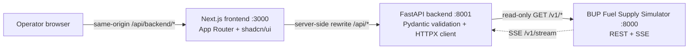
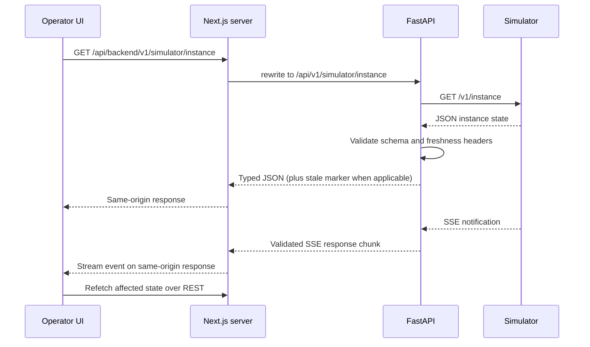
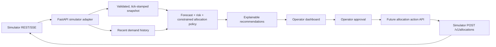

# Architecture overview

## Current repository architecture

Current implementations:

- **Frontend (`frontend/`)**: Next.js 16 App Router, React 19, TypeScript, Tailwind CSS v4, shadcn/ui, theme/toast/tooltip wrappers, TanStack Query provider, and a scaffold landing page. It does not yet render simulator state or recommendations.
- **Frontend-to-backend proxy**: Next rewrites `/api/backend/:path*` to the server-only `BACKEND_API_URL` plus `/api/:path*`. Example: browser `GET /api/backend/v1/simulator/instance` → FastAPI `GET /api/v1/simulator/instance`. This avoids browser calls to `localhost` and avoids requiring browser CORS for normal UI requests.
- **Backend (`backend/`)**: FastAPI with a reusable async HTTPX client configured by `SIMULATOR_BASE_URL` and `SIMULATOR_TIMEOUT_SECONDS`. It validates known simulator data with Pydantic models, maps upstream errors, forwards the stale-data header, and proxies documented SSE events.
- **Simulator**: supplied organizer image; expected local port is 8000. It is not part of this repository and must not be modified to solve the challenge.
- **Container/deployment layer**: root `docker-compose.yml` runs all three services and can target only `backend` (bringing up the simulator dependency) for a VPS + Vercel split. The two app Dockerfiles are under `backend/` and `frontend/`; `deploy/README.md` documents both modes. The Dockerfiles/Compose were authored and statically checked, but not built with Docker because no Docker daemon was available in the authoring environment.

## Intended end-to-end data path

REST remains the source of truth. SSE notifications should prompt the frontend to refetch affected state; after SSE reconnect, perform a full state refresh because the simulator does not replay missed events.

## Intended next layer: decision intelligence

The recommendation engine should be a pure/testable layer that receives a consistent state snapshot and recent demand history. Keep analysis output distinct from an approved allocation request. The current backend intentionally has **no action/write routes and no engine**.

## Runtime configuration and ports

| Service   | Default port | Relevant configuration                                                                              |
| --------- | -----------: | --------------------------------------------------------------------------------------------------- |
| Simulator |         8000 | Organizer image; simulator-specific environment is documented in its guide                          |
| FastAPI   |         8001 | `SIMULATOR_BASE_URL` defaults to `http://localhost:8000`; `SIMULATOR_TIMEOUT_SECONDS` defaults to 8 |
| Next.js   |         3000 | `BACKEND_API_URL` defaults to `http://127.0.0.1:8001`; value is server-only                         |

When running in containers, set `BACKEND_API_URL` to the backend service name, e.g. `http://backend:8001`, and `SIMULATOR_BASE_URL` to the simulator service name, e.g. `http://simulator:8000`. Do not ship a browser-visible environment variable containing a sandbox-only `localhost` address.

For the all-in-one stack, `docker compose up --build -d` builds both apps and starts the simulator. For split deployment, run `docker compose up -d --build backend` on the VPS (Compose also starts the simulator); set Vercel's build-time `BACKEND_API_URL` to the VPS HTTPS API origin. The Next rewrite is emitted at build time, so redeploy after changing it. Keep simulator/admin and backend host ports private; expose FastAPI through a TLS reverse proxy. Validate the SSE stream through the chosen Vercel/runtime platform because serverless response-duration limits may affect long-lived connections.

## Reliability boundaries

- The simulator can be unavailable, slow, stale, or streaming-disconnected.
- FastAPI provides schema validation and normalized gateway errors; backend liveness does not require simulator availability.
- The UI should label stale/degraded data and disable unsafe actions until refreshed.
- Recommendation computation should have a deterministic fallback policy if forecasting becomes unavailable.
- Allocation submission must use a stable idempotency key and only happen after operator approval.
- Logs/metrics should distinguish simulator faults from engine outcomes and frontend request failures.

## Persistence

The current implementation has no application database. The simulator owns its own state/history. When engine work begins, decide explicitly whether recommendations, operator approvals, and an audit trail need persistence. Persist the team's decision history if required; avoid copying the simulator's entire unbounded demand table without a retention/query plan.
